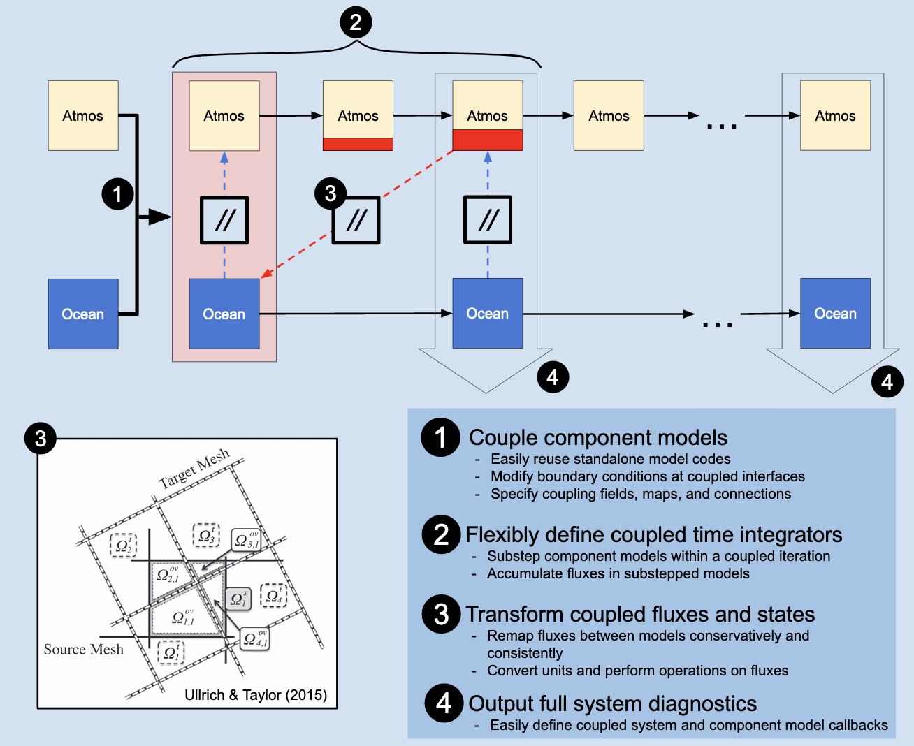

# Interface
The interface is designed to fascilitate modular use of model components, which can be run in a coupled or stand-alone mode using the same parent functions. 

*Currently this is awaiting the final cleanup of ClimaSimulations, so we use our own lightweight interface in the meantime.*

The [current prototyping interface](https://github.com/CliMA/ClimaCoupler.jl/blob/as/agu-seabreeze/experiments/ClimaCore/sea_breeze/run.jl) is:
- `model1_init`, `model2_init` - initialize ICs, BCs and domains as in the **standalone** versions
- `LinearRemap` - define for each direction that remapping is required (e.g. model1>model2, model2>model1)
- `cpl_run()`
    - define coupler fields and parameters
    - override BCs and ICs of stadalone setups
    - `ODEProblem` per model initializing the `rhs!`
    - `model_integ = init(problem, solver, dt, ...)` per model is initialized
    - sequential loop:
        - pre-model1 ops (includes resetting fluxes, `remap` operators)
        - step!(model1_integ,...)
        - post-model1 ops
        - pre-model2 ops
        - step!(model2_integ,...)
        - post-model2 ops
        - ...
    - return `model_integ`s
- NB: flux calculation and accumulation is done in model1 via the BC specification, customized in the coupler (with the `::CoupledFlux` trait)

The plan is:
- `Simulation(::Coupled, ...)` from ClimaSimulations.jl will replace `cpl_run()` to unify interface with Oceananigans
    - `solve!(::model, ::callbacks)` from DiffEq.jl, where callbacks interrupt the simulation to perform the coupling, call the diagnostics writer 
- provide a list of requirements for a model to be able to be coupled with ClimaESM

