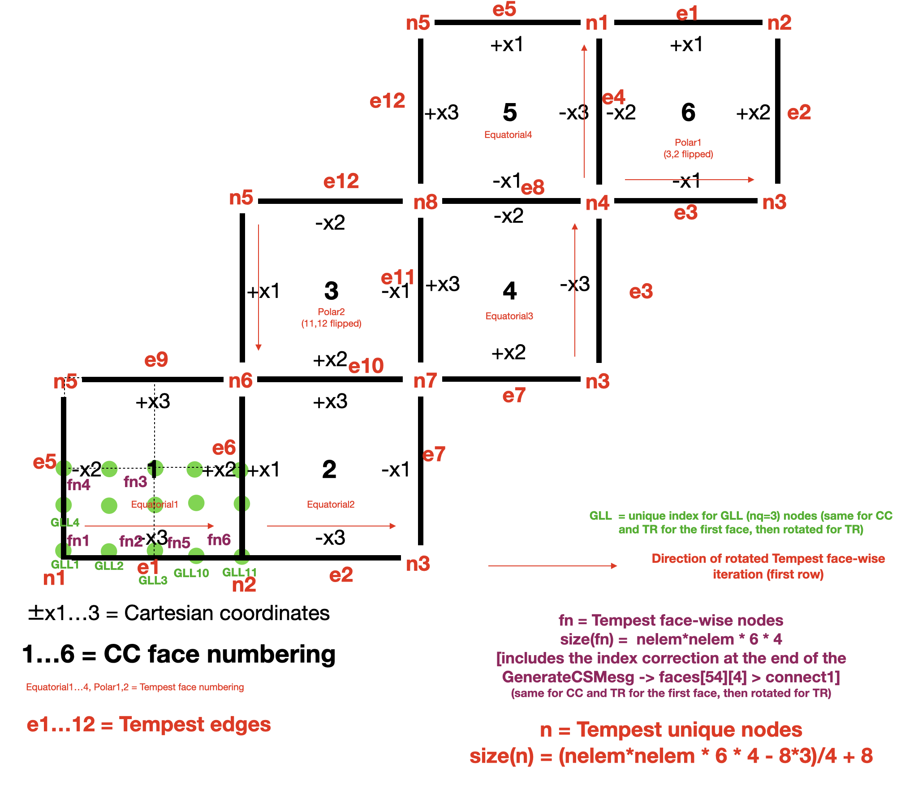

# **Spherical Remapping**

# TempestRemap
- TempestRemap uses a quadrature-based approach to produce a “first guess” operator that is then projected onto the space of conservative and consistent solutions using a novel least-squares formulation. The resulting method **avoids the need for line integrals and can be used to guarantee conservation and consistency** (and, if desired, monotonicity) of the linear map.
- CliMA will use TempestRemap as an intermediate solution for producing an overlap mesh and mapping from one input mesh to another

- TempestRemap and its mathematical formulation:
	- [Ullrich & Taylor 15](https://journals.ametsoc.org/view/journals/mwre/143/6/mwr-d-14-00343.1.xml )
	- [Ullrich et al. 16](https://journals.ametsoc.org/view/journals/mwre/144/4/mwr-d-15-0301.1.xml)
	- [TempestRemap Github](https://github.com/ClimateGlobalChange/tempestremap)

# [TempestRemap_jll](https://github.com/JuliaPackaging/Yggdrasil/tree/master/T/TempestRemap)
- subpackage that automatically configures TempestRemap and allows calls directly from Julia
- one would normally have to install TempestRemap and configure, in order to generate model meshes / overlap meshes / weights
	- e.g.: `./GenerateCSMesh --res 6 --alt --file gravitySam.000000.3d.cubedSphere_6.netcdf --out_format Netcdf4`
	- TempestRemap_jll simplifies this, avoiding the need to download / configure the original tempest remap 
- need Julia 1.7 
- Refs: [this PR](https://github.com/JuliaPackaging/Yggdrasil/pull/4174), [info on JLL pkgs](https://docs.binarybuilder.org/stable/jll/)
```
julia> using TempestRemap_jll

julia> run(`$(TempestRemap_jll.GenerateCSMesh_exe()) --res 6 --file cubedsphere_6.netcdf  --out_format Netcdf4`);
Parameters:
  --res <integer> [6] 
  --file <string> ["cubedsphere_6.netcdf"] 
  --out_format <string> ["Netcdf4"] 
  --alt <bool> [false] 
=========================================================
..Generating mesh with resolution [6]
..Writing mesh to file [cubedsphere_6.netcdf] 
Nodes per element
..Block 1 (4 nodes): 216
..Mesh generator exited successfully
=========================================================

shell> ncdump -h cubedsphere_6.netcdf
netcdf cubedsphere_6 {
dimensions:
	len_string = 33 ;
	len_line = 81 ;
	four = 4 ;
	time_step = UNLIMITED ; // (0 currently)
	num_dim = 3 ;
	num_nodes = 218 ;
	num_elem = 216 ;
	num_qa_rec = 1 ;
	num_el_blk = 1 ;
	num_el_in_blk1 = 216 ;
	num_nod_per_el1 = 4 ;
	num_att_in_blk1 = 1 ;
variables:
	double time_whole(time_step) ;
	char qa_records(num_qa_rec, four, len_string) ;
	char coor_names(num_dim, len_string) ;
	char eb_names(num_el_blk, len_string) ;
	int eb_status(num_el_blk) ;
	int eb_prop1(num_el_blk) ;
		eb_prop1:name = "ID" ;
	double attrib1(num_el_in_blk1, num_att_in_blk1) ;
	int connect1(num_el_in_blk1, num_nod_per_el1) ;
		connect1:elem_type = "SHELL4" ;
	int global_id1(num_el_in_blk1) ;
	int edge_type1(num_el_in_blk1, num_nod_per_el1) ;
	double coord(num_dim, num_nodes) ;

// global attributes:
		:api_version = 5.f ;
		:version = 5.f ;
		:floating_point_word_size = 8 ;
		:file_size = 0 ;
		:title = "tempest(cubedsphere_6.netcdf) 01/06/2022: 08:44:30" ;
}
```

# Tempest file format
- all files written for Tempest should be in the `Exodus` format
- Exodus is built upon either NetCDF or HDF5 (your choice). It can be used by native interpreters - i.e. it can be treated as a NetCDF file with [specific requirements](https://www.osti.gov/servlets/purl/6902151) for variables and metadata. It is supported by ParaView. It can store scalars, vectors, or matrices at nodes or cell centers.

# Tempest Cubed Sphere Connectivity

- (compare with CC - add test)

# TempestRemap implementation stages
### 1. Mesh generation
- Source/target meshes
	- cubed sphere: equiangular
	- lat-lon
	- geodesic
- Overlap mesh
	- collects intersections of the two meshes

### 2. Offline Linear Weight Map Generation
- Types 
	- FV
	- continuous FE
	- discontinuous FE


### 3. Map Application
- there are two options:
	- 3.a. Offline map application
		- to be called with `TempestRemap_jll` from ClimaCore
		- [example](https://github.com/CliMA/ClimaCore.jl/blob/main/lib/ClimaCoreTempestRemap/test/netcdf.jl#L62)
	- 3.b Online map application
		- ClimaCore can now do the sparse matrix multiply during the model run (it's faster than using TempestRemap for application)
		- [example](XXX)

## Alternatives
- [Conduit](https://llnl-conduit.readthedocs.io/en/latest/blueprint_mesh.html) - JSON + binary
- OASIS regridding - but quite clunky
- CMEPS - too much interface for now

# ClimaCore mesh

## Types available
- equidistant, equiangular, conformal 
- Mesh refs
	- [ClimaCore mesh docs](https://clima.github.io/ClimaCore.jl/dev/api/#Meshes
	)
	- [Rancic](https://journals.ametsoc.org/view/journals/mwre/145/3/mwr-d-16-0178.1.xml)

# Plotting refs
- [ClimaCore mesh viz](https://gist.github.com/LenkaNovak/b9c4ea8906bd7a9452b0b4c11bda9dee)
- [ClimateMachine mesh viz - Simon](https://gist.github.com/simonbyrne/968fdc39e1e94542bda3b2cf574c6a93)
- [ClimateMachine mesh viz - Valeria](https://gist.github.com/valeriabarra/e92f165008492b3208e2110672a3cef3) - GLMakie compatibiity issues
- [ClimaCorePlots](https://github.com/CliMA/ClimaCore.jl/tree/main/lib/ClimaCorePlots#climacoreplots)
- [ClimaCoreMakie](https://github.com/CliMA/ClimaCore.jl/blob/4b9c60192ea6963e6794dfa42f0f2d1b1bbe6825/lib/ClimaCoreMakie/README.md)
- [Plots recipes](https://docs.juliaplots.org/latest/recipes/)
- [andre makie plots](https://github.com/LenkaNovak/earth_system_modelling_guide/blob/main/numerical_design/mesh/ClimateMachineGridInitStateViz.ipynb)
- [ParaView and Exodus](https://discourse.paraview.org/t/which-file-format-is-right-for-me/6633/2)

# Questions
- tempest: restricts geometry to meshes composed exclusively of regions whose edges consist of great circle arcs - oceananigans conformal grid may introduce (small) errors
- tempest - achieves conservation/consistency via submaps and their weights from triangular quadrature; then least-square-based projection to correct

