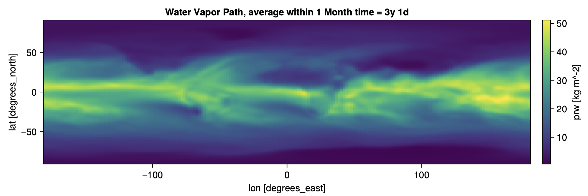
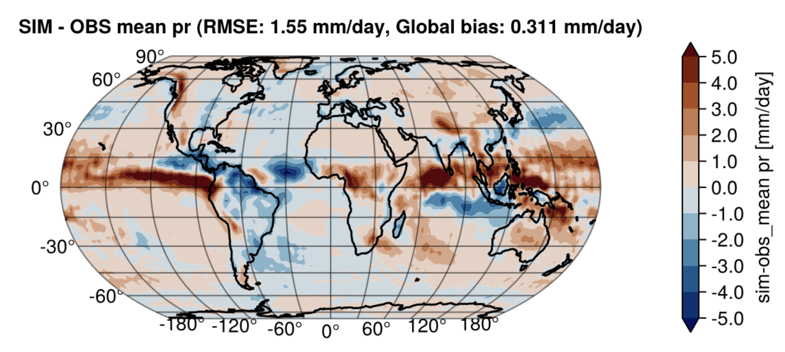
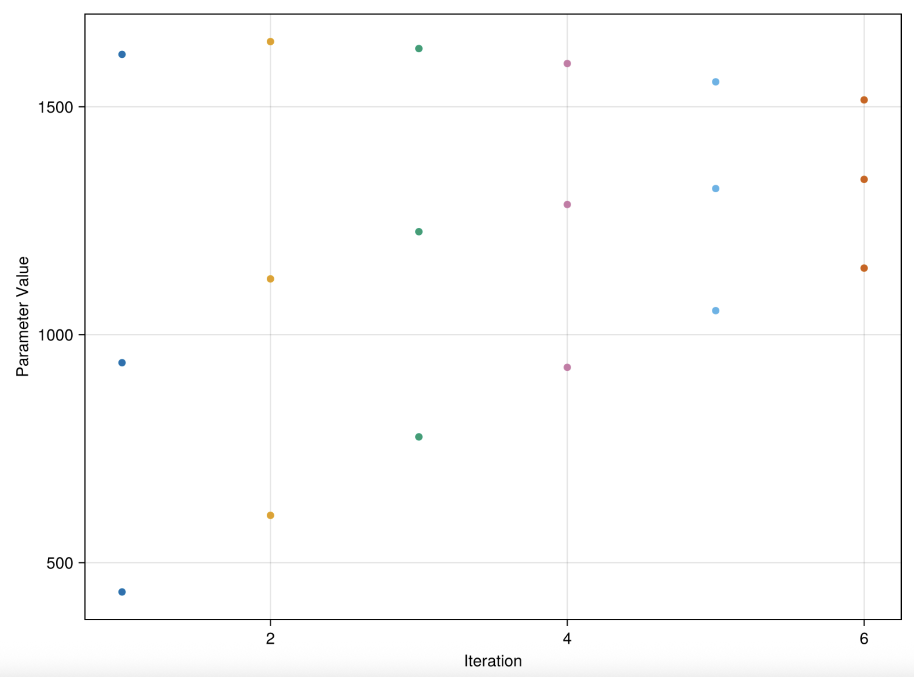
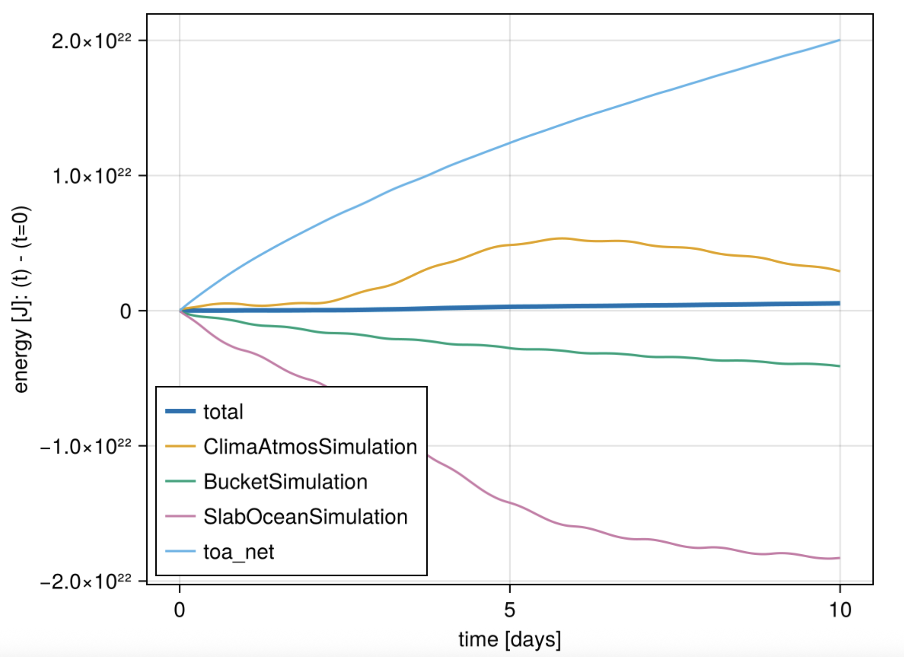
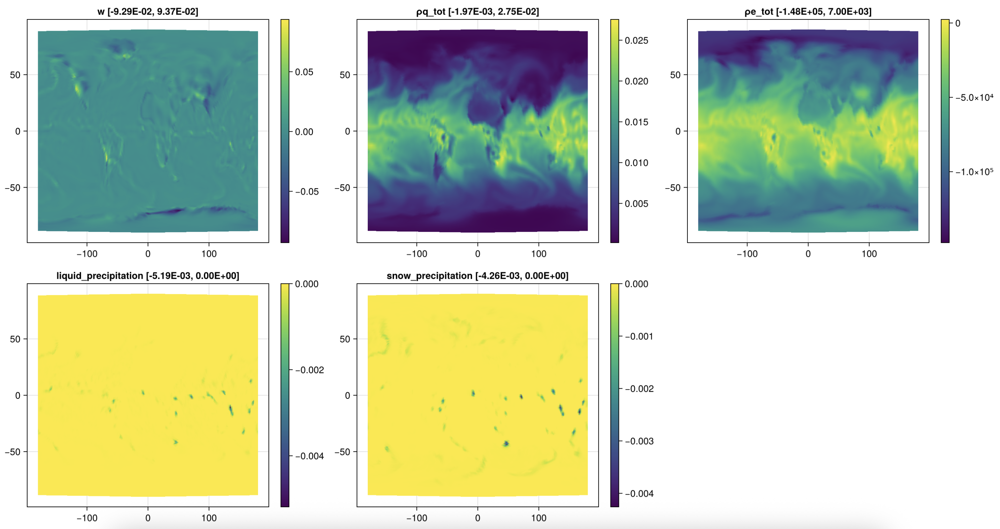
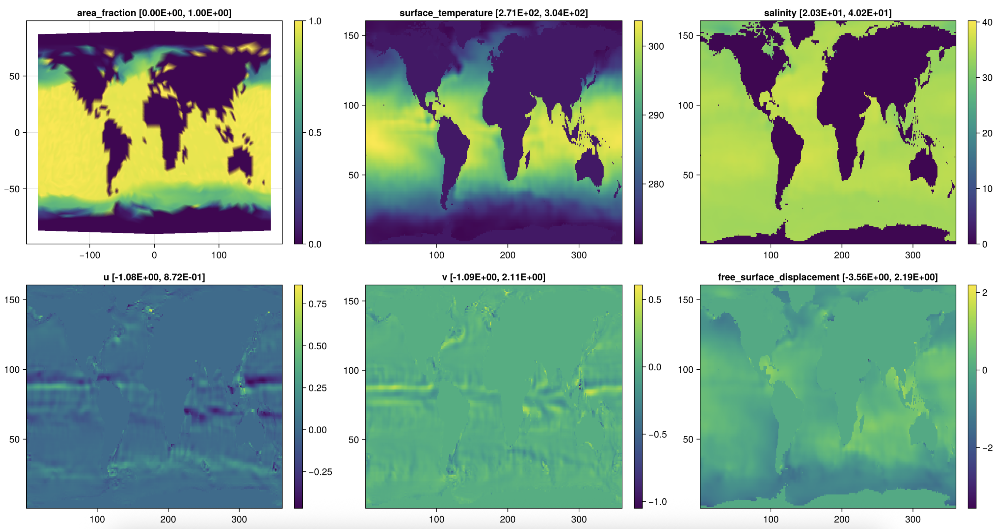

# Plotting

The `Plotting` module provides functionality for visualizing ClimaCoupler simulation output,
including diagnostic plots, visualizations for debugging, leaderboards comparing to observations,
and calibration parameter plots.

By default, the `Plotting` module provides stub implementations that do nothing.
The actual plotting implementations are provided by the `ClimaCouplerMakieExt` extension
when Makie.jl and related packages are available, and by `ClimaCouplerCMIPMakieExt`
when the plotting packages and Oceananigans.jl are available.

### Postprocessing

The `postprocess` function coordinates all postprocessing operations after a simulation completes,
including generating diagnostic plots, leaderboards, conservation plots, and debug visualizations.
It also performs RMSE checks against observations and closes diagnostics file writers.

**Note:** While `postprocess` can be called without the Makie extension loaded, it will not generate
any plots. To produce visualizations, ensure the `ClimaCouplerMakieExt` extension is loaded by
importing the required Makie packages (see [ClimaCouplerMakieExt Extension](@ref) below).

## ClimaCouplerMakieExt Extension

The `ClimaCouplerMakieExt` extension provides the actual implementations of all plotting functions when the following packages are loaded:

- `Makie` - The core plotting package
- `CairoMakie` - For PDF image output and other backend plotting work
- `ClimaCoreMakie` - For plotting ClimaCore fields
- `GeoMakie` - For geographic/map visualizations
- `Poppler_jll` - For saving PDFs nicely
- `Printf` - For string manipulation

### Loading the Extension

The extension is automatically loaded when you `using` or `import` all of the required Makie packages:

```julia
using Makie, GeoMakie, CairoMakie, ClimaCoreMakie, Poppler_jll, Printf
```

Once loaded, all plotting functions in the `Plotting` module will use the full implementations instead of the stub methods.

### Features

#### Diagnostics plots

ClimaCouplerMakieExt.jl uses ClimaAnalysis.jl to generate plots of diagnostic variables
saved using the ClimaDiagnostics.jl infrastructure.

For information about diagnostics in ClimaCoupler, including how to customize which
variables to save, how often, and with which reductions, see the [SimOutput](@ref) documentation.

For example, here is a plot of the atmosphere water vapor path diagnostic, generated using ClimaAnalysis.jl:


#### Leaderboards

Leaderboards compare simulation output against observational data, computing
bias and RMSE metrics for various variables. Both 2D surface variables
and 3D pressure-level variables are supported.

For detailed information about adding variables to leaderboards and customizing
comparisons, see the [Leaderboard](@ref) documentation.

For example, here is a leaderboard plot showing precipitation bias compared
to ERA5 data:


#### Calibration plots

Calibration plots visualize parameter calibration results, including scatter
plots of parameter values versus observations and parameter evolution across
iterations.

These plots are used to visualize the results of model parameter calibration
with EnsembleKalmanProcesses.jl.

For example, here is a plot of parameter value across iterations, generated
from a perfect model calibration experiment:


#### Conservation plots

Conservation plots show time series of global conservation quantities (energy and water)
over the course of a simulation. These plots help verify that the coupled system
maintains physical conservation properties.

Please note that the current AMIP/CMIP configurations are not expected to be conservative,
so conservation plots are only available for the Slabplanet configuration.

For information about conservation checks in ClimaCoupler, see the [ConservationChecker](@ref) documentation.

Here is an example plot of energy conservation over the course of a 10-day slabplanet simulation:


#### Debug plots

To facilitate debugging, ClimaCoupler.jl plots most coupler fields and model
fields of physical interest by default. These plots are availabe at the end of a simulation
in the provided artifacts directory.

Since these plots are intended for debugging, they are less polished than the other plotting options.

For example, here are the debug plots generation for the atmosphere component:


## ClimaCouplerCMIPMakieExt Extension

The `ClimaCouplerCMIPMakieExt` extension extends the base plotting functionality
to support Oceananigans.jl fields when Oceananigans is used as the ocean component model.

### Loading the Extension

The extension is automatically loaded when Oceananigans.jl and the required Makie packages are available:

```julia
using Makie, GeoMakie, CairoMakie, ClimaCoreMakie, Poppler_jll, Printf
using Oceananigans
```

The `ClimaCouplerCMIPExt` extension adds support for:

- **Oceananigans field plotting**: Extends `Plotting.debug_plot!` to handle `Oceananigans.Field`
  and `Oceananigans.AbstractOperations.AbstractOperation` types, allowing debug plots to visualize
  ocean model fields directly.

- **Oceananigans field extrema**: Extends `Plotting.print_extrema` to format the minimum and maximum
  values of Oceananigans fields for display in plot titles and labels.

These extensions enable the debug plotting system to automatically handle Oceananigans fields
when they are encountered in coupled simulations, without requiring any special handling in user code.

For example, here are the debug plots generation for the Oceananigans component:


## Plotting API

```@docs
Plotting.postprocess
Plotting.make_diagnostics_plots
Plotting.make_ocean_diagnostics_plots
Plotting.debug
Plotting.debug_plot_fields
Plotting.debug_plot!
Plotting.plot_global_conservation
Plotting.compute_leaderboard
Plotting.compute_pfull_leaderboard
```
