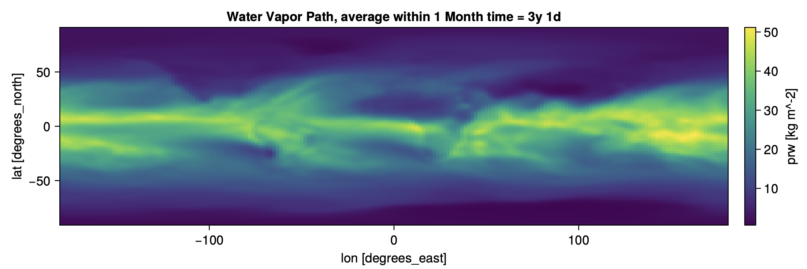
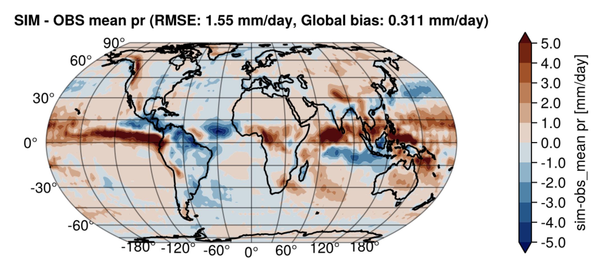
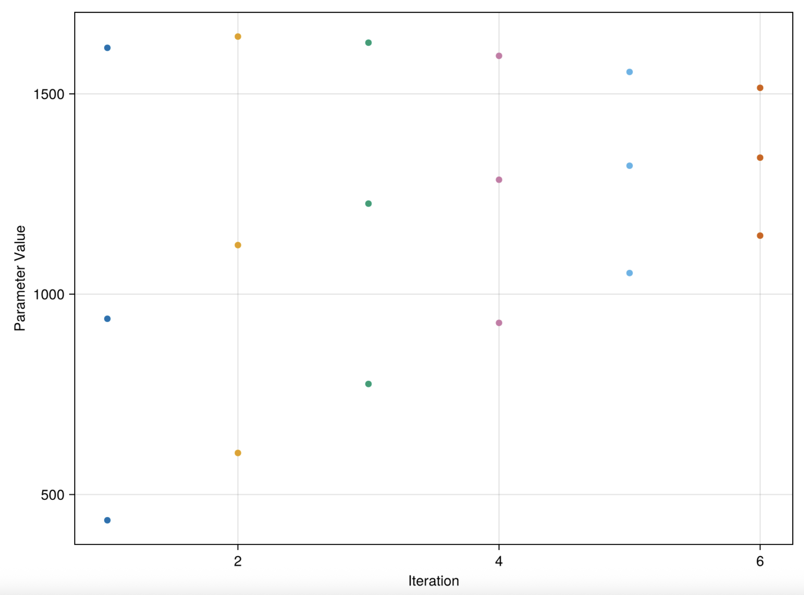
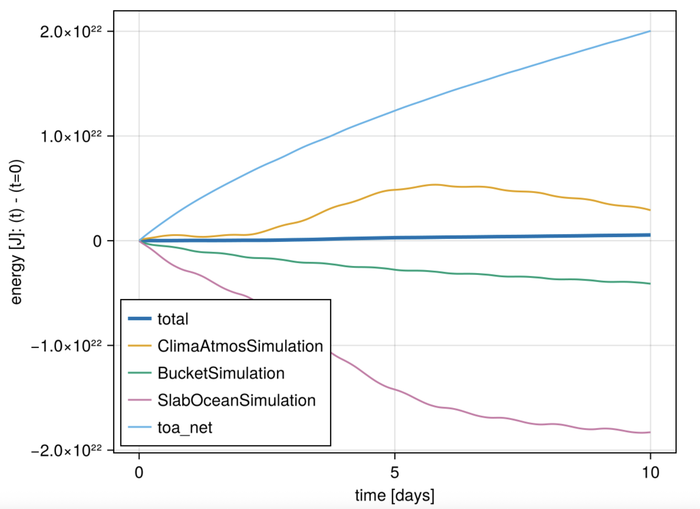

# Plotting

The `Plotting` module provides functionality for visualizing ClimaCoupler simulation output,
including instantaneous snapshot plots, diagnostic plots, leaderboards comparing to
observations, and calibration parameter plots.

By default, the `Plotting` module provides stub implementations that do nothing.
The actual plotting implementations are provided by the `ClimaCouplerMakieExt` extension
when Makie.jl and related packages are available.

### Output layout

Plots are written to the simulation's `artifacts` directory, grouped into
per-component subdirectories so that the top-level directory stays manageable
once periodic snapshots are added:

```
artifacts/
├── atmos_sim/
│   ├── snapshot_2010-01-01T00:00:00.png   # instantaneous snapshots (one per plot_interval)
│   ├── snapshot_2010-02-01T00:00:00.png
│   ├── summary_2D_2010_01_01.pdf    # end-of-run diagnostics (one per time step)
│   └── summary_2D_2010_02_01.pdf
├── ocean_sim/
├── land_sim/
├── ice_sim/
├── coupler/                         # component snapshots + coupler-field snapshots
└── ...                             # conservation and leaderboard plots
```

### Plot styling

All global (lat/lon) plots share a common style so that snapshots and diagnostics
look consistent:

- **Colormaps** are chosen per variable by [`Plotting.colormap_for`](@ref): e.g.
  precipitation uses `:rain`, temperature `:thermal`, salinity `:haline`. Fields
  that are inherently signed *by name* (velocities, fluxes, anomalies,
  displacements; see [`Plotting.is_divergent`](@ref)) use the divergent
  `:balance` colormap, centered on zero. Anything else falls back to `:viridis`.
  Divergence is decided by name only — not by whether the data happens to span
  zero — so that inherently-positive fields (temperature, salinity, area
  fraction) are never flipped to a symmetric scale by a few spurious negative
  values from remapping near coasts.
- Maps use the **Robinson projection** ([`Plotting.PROJECTION`](@ref)) and are
  drawn with **coastlines**, with the lat/lon graticule and its labels hidden.
- Each panel is titled with the variable name and units; the colorbar is narrow
  ([`Plotting.COLORBAR_WIDTH`](@ref)) and short (a fraction
  [`Plotting.COLORBAR_HEIGHT_FRACTION`](@ref) of the panel height) and unlabeled.
  The overall figure is titled like `Ocean snapshots at 2010-01-01`.
- Ocean and sea ice plots fill the continents in gray (land carries no data
  there).

### Snapshot plots

Instantaneous "snapshot" plots are produced *during* a run by a callback, at the
interval set by the `plot_interval` configuration flag (default `"1months"`; set
to `"never"` to disable). They read the live state directly via
`Interfacer.get_field`, so they are produced even for runs that crash before
completion — useful for debugging test runs. (Snapshots replace the older
end-of-run "debug" plots.)

Each component gets one figure per snapshot, saved as
`artifacts/<component>/snapshot_<date>.png`, plus one figure for the coupler
exchange fields (fluxes, area fractions, etc.) at
`artifacts/coupler/snapshot_<date>.png`. The component fields plotted are given
by [`Plotting.snapshot_plot_fields`](@ref) (e.g. surface speed, SST, and SSS for
the ocean), which can be specialized per component model.

### Postprocessing

The `postprocess` function coordinates all end-of-run postprocessing operations,
including generating diagnostic plots, leaderboards, and conservation plots. It
also performs RMSE checks against observations and closes diagnostics file
writers. Unlike the snapshot callback, `postprocess` covers the diagnostics that
require the full time series and so runs once the simulation completes.

By default (`plot_diagnostics = :all`) `postprocess` plots every saved time step
of each diagnostic; pass `plot_diagnostics = :last` to plot only the final
averaging window.

**Note:** While `postprocess` can be called without the Makie extension loaded, it will not generate
any plots. To produce visualizations, ensure the `ClimaCouplerMakieExt` extension is loaded by
importing the required Makie packages (see [ClimaCouplerMakieExt Extension](@ref) below).

## ClimaCouplerMakieExt Extension

The `ClimaCouplerMakieExt` extension provides the actual implementations of all plotting functions when the following packages are loaded:

- `Makie` - The core plotting package
- `CairoMakie` - For PDF image output and other backend plotting work
- `ClimaCoreMakie` - For plotting ClimaCore fields
- `GeoMakie` - For geographic/map visualizations
- `Poppler_jll` - For saving PDFs nicely
- `Printf` - For string manipulation

### Loading the Extension

The extension is automatically loaded when you `using` or `import` all of the required Makie packages:

```julia
using Makie, GeoMakie, CairoMakie, ClimaCoreMakie, Poppler_jll, Printf
```

Once loaded, all plotting functions in the `Plotting` module will use the full implementations instead of the stub methods.

### Features

#### Snapshot plots

Instantaneous snapshot plots of each component model's key surface fields, and of
the coupler exchange fields, are generated periodically during a run (see
[Snapshot plots](@ref) above). Each field is remapped onto the coupler boundary
space and plotted on a global map with the shared plot styling. These replace the
older debug plots.

#### Diagnostics plots

ClimaCouplerMakieExt.jl uses ClimaAnalysis.jl to generate plots of diagnostic variables
saved using the ClimaDiagnostics.jl infrastructure (atmosphere, land, and coupler).

By default every saved time step is plotted (one summary file per time step per
component); pass `plot_diagnostics = :last` to `postprocess` to plot only the
final averaging window.

For information about diagnostics in ClimaCoupler, including how to customize which
variables to save, how often, and with which reductions, see the [SimOutput](@ref) documentation.

For example, here is a plot of the atmosphere water vapor path diagnostic, generated using ClimaAnalysis.jl:


The Oceananigans-based ocean and sea ice components write their surface
diagnostics as Oceananigans JLD2 output on their native (possibly curvilinear)
grids. These are plotted by the [ClimaCouplerCMIPMakieExt Extension](@ref) using
the same global styling.

#### Leaderboards

Leaderboards compare simulation output against observational data, computing
bias and RMSE metrics for various variables. Both 2D surface variables
and 3D pressure-level variables are supported.

For detailed information about adding variables to leaderboards and customizing
comparisons, see the [Leaderboard](@ref) documentation.

For example, here is a leaderboard plot showing precipitation bias compared
to ERA5 data:


#### Calibration plots

Calibration plots visualize parameter calibration results, including scatter
plots of parameter values versus observations and parameter evolution across
iterations.

These plots are used to visualize the results of model parameter calibration
with EnsembleKalmanProcesses.jl.

For example, here is a plot of parameter value across iterations, generated
from a perfect model calibration experiment:


#### Conservation plots

Conservation plots show time series of global conservation quantities (energy and water)
over the course of a simulation. These plots help verify that the coupled system
maintains physical conservation properties.

Please note that the current AMIP/CMIP configurations are not expected to be conservative,
so conservation plots are only available for the Slabplanet configuration.

For information about conservation checks in ClimaCoupler, see the [ConservationChecker](@ref) documentation.

Here is an example plot of energy conservation over the course of a 10-day slabplanet simulation:


## ClimaCouplerCMIPMakieExt Extension

The `ClimaCouplerCMIPMakieExt` extension plots the diagnostics of the
Oceananigans-based ocean and sea ice components. It is loaded automatically when
Oceananigans and the Makie packages are available:

```julia
using Makie, GeoMakie, CairoMakie, Poppler_jll, Printf
using Oceananigans
```

The ocean and sea ice write their surface diagnostics as Oceananigans JLD2
`FieldTimeSeries` output (`ocean_surface`, `seaice_surface`) on their native
(possibly curvilinear, e.g. tripolar) grids. `Plotting.make_ocean_diagnostics_plots`
and `Plotting.make_seaice_diagnostics_plots` read those series and plot each
field on a global map — using the field's own longitude/latitude nodes as
coordinates, so curvilinear grids are handled correctly — with the same shared
styling (Robinson projection, coastlines, per-variable colormaps) as the other
diagnostics. Like the other diagnostics, they honor `plot_diagnostics`
(`:all`/`:last`).

Ocean fields: surface current speed, sea surface temperature, salinity, and
height. Sea ice fields: drift speed, concentration, thickness, and top-surface
temperature.

## Plotting API

```@docs
Plotting.postprocess
Plotting.plot_snapshots
Plotting.snapshot_plot
Plotting.snapshot_plot_fields
Plotting.colormap_for
Plotting.is_divergent
Plotting.geo_plot_kwargs
Plotting.component_artifacts_dir
Plotting.PROJECTION
Plotting.COLORBAR_WIDTH
Plotting.COLORBAR_HEIGHT_FRACTION
Plotting.make_diagnostics_plots
Plotting.make_ocean_diagnostics_plots
Plotting.make_seaice_diagnostics_plots
Plotting.plot_global_conservation
Plotting.compute_leaderboard
Plotting.compute_pfull_leaderboard
```
