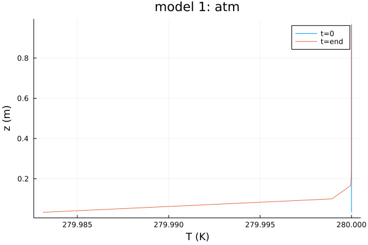
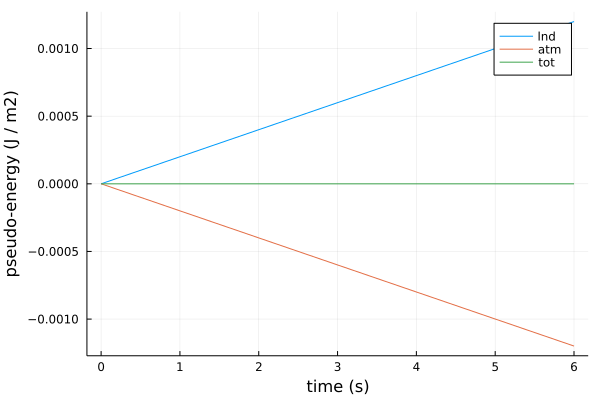
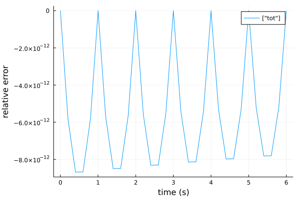

# Heat Equation + Slab Tutorial

In this tutorial, we demonstrate simple sequential coupling
of two PDE models using the `ClimaCore.jl` backends.

# Model 1
Model 1 represents a simplified atmosphere (atm)
and solves the [heat
equation](https://en.wikipedia.org/wiki/Heat_equation)
in a one-column domain:

``
\frac{∂ T}{∂ t} + ∇ ⋅ (-μ ∇T) = 0
``

   with top and bottom boundary conditions set to fixed-temperature (non-zero Dirichlet) and fixed-flux (non-zero Neumann) conditions, respectively:

``
   T_{top}  = 280 K \,\,\,\,\,\,\, \frac{∂ T_{bottom}}{∂ t} = - ∇ F_{sfc}
``

where
 - `t` is time
 - `μ` is the thermal diffusivity
 - `T` is the temperature
 - `F_sfc` is the thermal boundary flux (see below for calculation)

# Model 2
Model 2 represents a simplified soil (lnd) domain as a slab, represented by the ODE:

``
   \frac{dT_{sfc}}{dt} = - (F_{accumulated} + G ) / h_{lnd}
``

   where

``
   F_{accumulated} = {F_{integrated}} / Δt_{coupler}
``

where
 - `Δt_coupler` is the duration of the coupling cycle
 - `T_sfc` is the temperature
 - `h_lnd` is the slab thickness
 - `F_integrated` and `F_accumulated` thermal boundary fluxes, respectively (see below for calculation)

# Coupling and Flux Calculation

We use this Model 1 (usually this is done by the model with the shortest timestep)
to calculate and accumulate the downward surface fluxes, `F_sfc`:

``
   F_{sfc} = - λ * (T_{sfc} - T1)
``

``
   d(F_{integrated})/dt  = F_{sfc}
``

where
 - `T1` is the atm temperature near the surface (here assumed equal to the first model level)
 - `λ` a constant relaxation timescale

Sequential coupling has the following steps:
1) pre-Model 1: supply Model 1 with `T_sfc` for the `F_sfc` caclulation; reset `F_integrated` to zero
2) run Model 1: step forward for all Model 1 timesteps within one coupling cycle using `F_sfc` as the bottom boundary condition; accumulate `F_integrated` at each (sub-)step
3) post-Model 1: pass `F_integrated` into coupler and convert to `F_accumulated` for the correct units.
4) pre-Model 2: supply Model 2 with `F_accumulated`
5) run Model 2: step forward for all Model 2 timesteps within one coupling cycle;
6) post-Model 2: state variable, `T_sfc` of Model 2 into coupler.
7) repeat steps 1-6 for all coupling timesteps.

# Implementation

## Loading Packages

First, we'll load our pre-requisites:
 - load CliMA packages under development - you may need to add unregistered packages in Pkg, e.g.:

````julia
# import Pkg; Pkg.add(url="https://github.com/CliMA/ClimaCore.jl",rev="main")
````

 - load external packages:

````julia
import ClimaCore.Geometry, LinearAlgebra, UnPack
import ClimaCore:
    Fields,
    Domains,
    Topologies,
    Meshes,
    DataLayouts,
    Operators,
    Geometry,
    Spaces

using Base: show_supertypes
using OrdinaryDiffEq: ODEProblem, solve, SSPRK33

using Logging: global_logger
using TerminalLoggers: TerminalLogger

using RecursiveArrayTools

using OrdinaryDiffEq, Test, Random

using Statistics
````

## Setup Logging Information

````julia
# comment out for tutorial generation
# global_logger(TerminalLogger())
# const CI = !isnothing(get(ENV, "CI", nothing))
````

## Define Parameters
 - Global Constants

````julia
const FT = Float64;
````

 - Experiment-specific Parameters

````julia
parameters = (
    # atmos parameters
    zmin_atm = FT(0.0), # height of atm stack bottom [m]
    zmax_atm = FT(1.0), # height of atm stack top [m]
    n = 15,  # number of elements in atm stack
    μ = FT(0.0001), # diffusion coefficient [m^2 / s]
    T_top = FT(280.0), # fixed temperature at the top of the domain_atm [K]
    T_atm_ini = FT(280.0), # initial condition of at temperature (isothermal) [K]
    # slab parameters
    h_lnd = FT(0.5), # depth of slab layer [m]
    T_lnd_ini = FT(260.0), # initial condition of at temperature (isothermal) [K]
    # coupling parameters
    λ = FT(1e-5), # transfer coefficient
    );
````

## Define Model Functions

- Model 1 (atm) Equations

````julia
"""
    ∑tendencies_atm!(du, u, (parameters, T_sfc), t)

Heat diffusion equation
    dT/dt =  ∇ μ ∇ T
    where
        T  = 280 K              at z = zmax_atm
        dT/dt = - ∇ F_sfc       at z = zmin_atm

    We also use this model to calculate and accumulate the downward surface fluxes, F_sfc:
        F_sfc = - λ * (T_sfc - T1)
        d(F_integrated)/dt  = F_sfc
        where
            F_integrated is reset to 0 at the beginning of each coupling cycle
            T1 = atm temperature near the surface (here assumed equal to the first model level)
"""
function ∑tendencies_atm!(du, u, (parameters, T_sfc), t)
    T = u.x[1] # u.x = vector of prognostic variables from DifferentialEquations
    F_sfc = calculate_flux(T_sfc[1], parent(T)[1], parameters)
    # set BCs
    bcs_bottom = Operators.SetValue(Geometry.Cartesian3Vector(F_sfc)) # F_sfc is converted to a Cartesian vector in direction 3 (vertical)
    bcs_top = Operators.SetValue(FT(parameters.T_top))

    gradc2f = Operators.GradientC2F(top = bcs_top) # Dirichlet BC (center-to-face)
    gradf2c = Operators.DivergenceF2C(bottom = bcs_bottom) # Neumann BC (face-to-center)

    # tendency calculations
    @. du.x[1] = gradf2c( parameters.μ * gradc2f(T)) # dT/dt
    du.x[2] .= - F_sfc[1] # d(F_integrated)/dt
end;
````

- Model 2 (lnd) Equations

````julia
"""
    ∑tendencies_lnd!(dT_sfc, T_sfc, (parameters, F_accumulated), t)

Slab layer equation
    lnd d(T_sfc)/dt = - (F_accumulated + G) / h_lnd
    where
        F_accumulated = F_integrated / Δt_coupler
"""
function ∑tendencies_lnd!(dT_sfc, T_sfc, (parameters, F_accumulated), t)
    G = 0.0 # place holder for soil dynamics
    @. dT_sfc = ( - F_accumulated + G) / parameters.h_lnd
end;
````

- Surface Flux Calculation (coarse bulk formula)

````julia
calculate_flux(T_sfc, T1, parameters) = - parameters.λ * (T_sfc - T1);
````

- Coupler Communication Functions
These functions export / import / transform variables
These functions are now just place holders for coupler transformations (e.g. regridding, masking, etc)

````julia
coupler_get(x) = x;
coupler_put(x) = x;
````

## Model Initialization
- initialize atm model domain and grid

````julia
domain_atm = Domains.IntervalDomain(
    Geometry.ZPoint{FT}(parameters.zmin_atm),
    Geometry.ZPoint{FT}(parameters.zmax_atm);
    boundary_tags = (:bottom, :top),
);
mesh_atm = Meshes.IntervalMesh(domain_atm, nelems = parameters.n); # struct, allocates face boundaries to 5,6: atmos
center_space_atm = Spaces.CenterFiniteDifferenceSpace(mesh_atm); # collection of the above, discretises space into FD and provides coords
````

- initialize prognostic variables, either as ClimaCore's Field objects or as Arrays

````julia
T_atm_0 = Fields.ones(FT, center_space_atm) .* parameters.T_atm_ini; # initiates a spatially uniform atm progostic var
T_lnd_0 = [parameters.T_lnd_ini]; # initiates lnd progostic var
ics = (;
        atm = T_atm_0,
        lnd = T_lnd_0
        );
````

- specify timestepping information

````julia
stepping = (;
        Δt_min = 0.02,
        timerange = (0.0, 6.0),
        Δt_coupler = 1.0,
        odesolver = SSPRK33(),
        nsteps_atm = 8, # number of timesteps of atm per coupling cycle
        nsteps_lnd = 1, # number of timesteps of lnd per coupling cycle
        );
````

## Define the sequential coupling loop

````julia
function coupler_solve!(stepping, ics, parameters)
    t = 0.0
    Δt_min  = stepping.Δt_min
    Δt_coupler  = stepping.Δt_coupler
    t_start = stepping.timerange[1]
    t_end   = stepping.timerange[2]

    # init coupler fields
    coupler_F_sfc = [0.0]
    coupler_T_lnd = copy(ics.lnd)

    # atmos copies of coupler variables
    atm_T_lnd = copy(coupler_T_lnd)
    atm_F_sfc = copy(coupler_F_sfc)

    ## SETUP ATMOS
    # put all prognostic variable arrays into a vector and ensure that solve can partition them
    T_atm = ics.atm
    Y_atm = ArrayPartition((T_atm, atm_F_sfc))
    prob_atm = ODEProblem(∑tendencies_atm!, Y_atm, (t_start, t_end), (parameters, atm_T_lnd))
    integ_atm = init(
                        prob_atm,
                        stepping.odesolver,
                        dt = Δt_min,
                        saveat = 10 * Δt_min,)

    # land copies of coupler variables
    T_lnd = ics.lnd
    lnd_F_sfc = copy(coupler_F_sfc)

    ## SETUP LAND
    prob_lnd = ODEProblem(∑tendencies_lnd!, T_lnd, (t_start, t_end), (parameters, lnd_F_sfc))
    integ_lnd = init(
                        prob_lnd,
                        stepping.odesolver,
                        dt = Δt_min,
                        saveat = 10 * Δt_min,)

    # coupler stepping
    for t in (t_start : Δt_coupler : t_end)

        # STEP ATMOS
        # pre_atmos
        integ_atm.p[2] .= coupler_get(coupler_T_lnd) # integ_atm.p is the parameter vector of an ODEProblem from DifferentialEquations
        integ_atm.u.x[2] .= [0.0] # surface flux to be accumulated

        # run atmos
        # NOTE: use (t - integ_atm.t) here instead of Δt_coupler to avoid accumulating roundoff error in our timestepping.
        step!(integ_atm, t - integ_atm.t, true)

        # post_atmos
        coupler_F_sfc .= coupler_put(integ_atm.u.x[2]) / Δt_coupler

        # STEP LAND
        # pre_land
        lnd_F_sfc .= coupler_get(coupler_F_sfc)

        # run land
        step!(integ_lnd, t - integ_lnd.t, true)

        # post land
        coupler_T_lnd .= coupler_put(integ_lnd.u) # update T_sfc
    end

    return integ_atm, integ_lnd
end;
````

## Run the Coupler Model Simulation

````julia
integ_atm, integ_lnd = coupler_solve!(stepping, ics, parameters);
sol_atm, sol_lnd = integ_atm.sol, integ_lnd.sol;
````

## Postprocessing and Visualization

Each integrator output (`sol_atm`, `sol_lnd`), contains the DifferentialEquations variable `.u` (the name is hard coded).
If `ArrayPartition` was used for combining multiple prognostic variables, `u` will include an additional variable `x` (also hard coded)
`parent()` accesses the `Field` values.
So, for example, the structure of `u` from Model 1 is:

`parent(sol_atm.u[<time-index>].x[<ArrayPartition-index>])[<z-index>,<variable-index>]`

````julia
ENV["GKSwstype"] = "nul"
import Plots
Plots.GRBackend()

show_plots = isdefined(Main,:show_plots) ? show_plots : true

path = string(@__DIR__ , "/images/")
mkpath(path);
````

- Vertical profile at start and end

````julia
t0_ = parent(sol_atm.u[1].x[1])[:,1];
tend_ = parent(sol_atm.u[end].x[1])[:,1];
z_centers = parent(Fields.coordinate_field(center_space_atm))[:,1];
show_plots ? Plots.png(Plots.plot([t0_ tend_], z_centers, title = "model 1: atm", labels = ["t=0" "t=end"], xlabel = "T (K)", ylabel = "z (m)" ), joinpath(path, "tc1_f1.png")) : nothing
````



- Conservation: absolute "energy" of both models with time
convert to the same units (analogous to energy conservation, assuming that is both domains density=1 and thermal capacity=1)

````julia
lnd_sfc_u_t = [u[1] for u in sol_lnd.u] .* parameters.h_lnd;
atm_sum_u_t = [sum(parent(u.x[1])[:]) for u in sol_atm.u] .* (parameters.zmax_atm - parameters.zmin_atm) ./ parameters.n;
v1 = lnd_sfc_u_t .- lnd_sfc_u_t[1] ;
v2 = atm_sum_u_t .- atm_sum_u_t[1] ;
show_plots ? Plots.png(Plots.plot(sol_lnd.t, [v1 v2 v1+v2], labels = ["lnd" "atm" "tot"], xlabel = "time (s)", ylabel = "pseudo-energy (J / m2)"), joinpath(path, "tc1_f2.png")) : nothing
````



- Conservation: relative error with time

````julia
total = atm_sum_u_t + lnd_sfc_u_t;
rel_error = (total .- total[1]) / mean(total);
show_plots ? Plots.png(Plots.plot(sol_lnd.t, rel_error, labels = ["tot"], xlabel = "time (s)", ylabel = "relative error"), joinpath(path, "tc1_f3.png")) : nothing
````



````julia
# # - Animation
# anim = Plots.@animate for u in sol_atm.u
#     Plots.plot(u.x[1], xlim=(220,280))
# end
# Plots.mp4(anim, joinpath(path, "heat.mp4"), fps = 10)
#
# function linkfig(figpath, alt = "")
#     # buildkite-agent upload figpath
#     # link figure in logs if we are running on CI
#     if get(ENV, "BUILDKITE", "") == "true"
#         artifact_url = "artifact://$figpath"
#         print("\033]1338;url='$(artifact_url)';alt='$(alt)'\a\n")
#     end
# end
#
# dirname = "heat"
# linkfig("output/$(dirname)/heat_end.png", "Heat End Simulation")
````

---

*This page was generated using [Literate.jl](https://github.com/fredrikekre/Literate.jl).*

